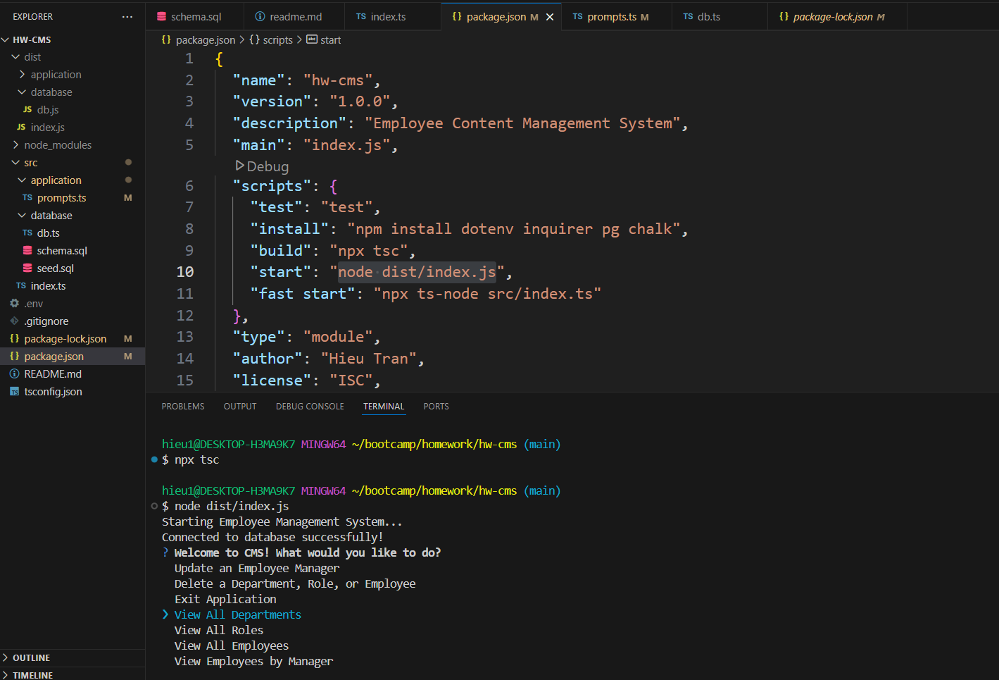

# Employee Manager CLI

## Description
Employee Manager is a command-line interface (CLI) application designed to help business owners efficiently manage their company's employee database. Users can view and manage departments, roles, and employees, as well as add new entries and update employee roles.

## Table of Contents
- [Installation](#installation)
- [Usage](#usage)
- [Features](#features)
- [Database Schema](#database-schema)
  - [Department](#department)
  - [Role](#role)
  - [Employee](#employee)
- [Technologies Used](#technologies-used)
- [Screenshots](#screenshots)
- [Contributing](#contributing)
- [License](#license)
- [Contact](#contact)

## Installation
### Clone the Repository
```sh
git clone https://github.com/hieu12-12/hw-cms-
```

### Install Dependencies
```sh
npm install
```

### Configure Database
Create a `.env` file in the root directory with your PostgreSQL credentials:
```env
DB_USER=your_username
DB_PASSWORD=your_password
```

Set up the database:
```sh
psql -U postgres -f db/schema.sql
psql -U postgres -f db/seed.sql
```

## Usage
Start the application by running:
```sh
npm start
```

## Features
- View all departments
- View all roles
- View all employees
- Add a department
- Add a role
- Add an employee
- Update an employee's role

## Database Schema
### Department
- `id`: `INT PRIMARY KEY`
- `name`: `VARCHAR(30)`

### Role
- `id`: `INT PRIMARY KEY`
- `title`: `VARCHAR(30)`
- `salary`: `DECIMAL`
- `department_id`: `INT FOREIGN KEY`

### Employee
- `id`: `INT PRIMARY KEY`
- `first_name`: `VARCHAR(30)`
- `last_name`: `VARCHAR(30)`
- `role_id`: `INT FOREIGN KEY`
- `manager_id`: `INT FOREIGN KEY`

## Technologies Used
- Node.js
- TypeScript
- PostgreSQL
- Inquirer
- Figlet (for CLI styling)
- pg (PostgreSQL client)
- dotenv

## Screenshots
### Main Menu



## Contributing
Pull requests are welcome. For major changes, please open an issue first to discuss proposed modifications.

## License
This project is licensed under the MIT License.

